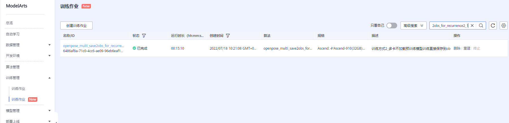

- [1. 企业实训复现指导手册——基于华为ModelArts平台的OpenPose模型的训练和推理](#1-企业实训复现指导手册基于华为modelarts平台的openpose模型的训练和推理)
- [2. **需要先看的**](#2-需要先看的)
- [3. **代码说明**](#3-代码说明)
  - [3.1. **训练代码**](#31-训练代码)
    - [3.1.1. 关键代码1：实现模型接续训练](#311-关键代码1实现模型接续训练)
    - [3.1.2. 关键代码2：实现训练过程中产生的ckpt文件直接保存到OBS](#312-关键代码2实现训练过程中产生的ckpt文件直接保存到obs)
    - [3.1.3. 关键代码3：实现多卡训练时每张卡都保存训练过程中的ckpt文件](#313-关键代码3实现多卡训练时每张卡都保存训练过程中的ckpt文件)
    - [3.1.4. 关键代码4：控制最大epoch数](#314-关键代码4控制最大epoch数)
    - [3.1.5. 关键代码5：让代码更灵活！](#315-关键代码5让代码更灵活)
  - [3.2. **推理代码**](#32-推理代码)
    - [3.2.1. **“上帝视角”“审视”代码——整体上看**](#321-上帝视角审视代码整体上看)
    - [3.2.2. **入口主函数val()方法**](#322-入口主函数val方法)
      - [3.2.2.1. 步骤1：构建训练配置信息](#3221-步骤1构建训练配置信息)
      - [3.2.2.2. 步骤2：复制文件](#3222-步骤2复制文件)
      - [3.2.2.3. 步骤3：加载模型、读取图片、调用模型进行推理](#3223-步骤3加载模型读取图片调用模型进行推理)
      - [3.2.2.4. 步骤4：复制文件](#3224-步骤4复制文件)
    - [3.2.3. **个人封装的infer_one_pic方法**](#323-个人封装的infer_one_pic方法)
      - [3.2.3.1. (1) 读取图片](#3231-1-读取图片)
      - [3.2.3.2. (2) 模型推理](#3232-2-模型推理)
      - [3.2.3.3. (3) 关键点数据解析](#3233-3-关键点数据解析)
      - [3.2.3.4. (4) 行为类别判断](#3234-4-行为类别判断)
      - [3.2.3.5. (5) 图片渲染绘制](#3235-5-图片渲染绘制)
      - [3.2.3.6. (6) 图片保存](#3236-6-图片保存)
    - [3.2.4. **个人封装的ActionTypeJudger类**](#324-个人封装的actiontypejudger类)
  - [3.3. **合并多卡训练生成的ckpt文件的脚本程序**](#33-合并多卡训练生成的ckpt文件的脚本程序)
    - [3.3.1. 步骤1：修改训练卡的数量](#331-步骤1修改训练卡的数量)
    - [3.3.2. 步骤2：修改路径](#332-步骤2修改路径)
    - [3.3.3. 步骤3：修改文件名模板字符串](#333-步骤3修改文件名模板字符串)
    - [3.3.4. 步骤4：运行程序](#334-步骤4运行程序)
  - [3.4. **标注文件labelme->coco格式转换脚本程序**](#34-标注文件labelme-coco格式转换脚本程序)
    - [3.4.1. 步骤1：修改源文件夹路径](#341-步骤1修改源文件夹路径)
    - [3.4.2. 步骤2：修改结果json文件的路径](#342-步骤2修改结果json文件的路径)
    - [3.4.3. 步骤3：辛辛苦苦地运行和等待一会儿会儿](#343-步骤3辛辛苦苦地运行和等待一会儿会儿)
- [4. **复现指导**](#4-复现指导)
  - [4.1. **训练代码**](#41-训练代码)
    - [4.1.1. **训练方式1：单卡不接续训练且直接保存到OBS**](#411-训练方式1单卡不接续训练且直接保存到obs)
      - [4.1.1.1. 步骤1：解压工程文件压缩包](#4111-步骤1解压工程文件压缩包)
      - [4.1.1.2. 步骤2：修改训练的Epoch数](#4112-步骤2修改训练的epoch数)
      - [4.1.1.3. 步骤3：上传到OBS](#4113-步骤3上传到obs)
      - [4.1.1.4. 步骤4：创建训练作业](#4114-步骤4创建训练作业)
      - [4.1.1.5. 步骤5：等待训练完成](#4115-步骤5等待训练完成)
    - [4.1.2. **训练方式2：多卡不接续训练且直接保存到OBS**](#412-训练方式2多卡不接续训练且直接保存到obs)
      - [4.1.2.1. 步骤1：解压工程文件压缩包](#4121-步骤1解压工程文件压缩包)
      - [4.1.2.2. 步骤2：修改训练的Epoch数](#4122-步骤2修改训练的epoch数)
      - [4.1.2.3. 步骤3：上传到OBS](#4123-步骤3上传到obs)
      - [4.1.2.4. 步骤4：创建训练作业](#4124-步骤4创建训练作业)
      - [4.1.2.5. 步骤5：等待训练完成](#4125-步骤5等待训练完成)
    - [4.1.3. **训练方式3：单卡实现接续训练且直接保存到OBS**](#413-训练方式3单卡实现接续训练且直接保存到obs)
      - [4.1.3.1. 步骤1：解压工程文件压缩包](#4131-步骤1解压工程文件压缩包)
      - [4.1.3.2. 步骤2：修改训练的Epoch数](#4132-步骤2修改训练的epoch数)
      - [4.1.3.3. 步骤3：上传到OBS](#4133-步骤3上传到obs)
      - [4.1.3.4. 步骤4：创建训练作业](#4134-步骤4创建训练作业)
      - [4.1.3.5. 步骤5：等待训练完成](#4135-步骤5等待训练完成)
    - [4.1.4. **训练方式4：多卡实现接续训练直接保存到OBS**](#414-训练方式4多卡实现接续训练直接保存到obs)
      - [4.1.4.1. 步骤1：解压工程文件压缩包](#4141-步骤1解压工程文件压缩包)
      - [4.1.4.2. 步骤2：修改训练的Epoch数](#4142-步骤2修改训练的epoch数)
      - [4.1.4.3. 步骤3：上传到OBS](#4143-步骤3上传到obs)
      - [4.1.4.4. 步骤4：创建训练作业](#4144-步骤4创建训练作业)
      - [4.1.4.5. 步骤5：等待训练完成](#4145-步骤5等待训练完成)
  - [4.2. **推理代码**](#42-推理代码)
    - [4.2.1. 步骤1：下载并上传项目相关文件](#421-步骤1下载并上传项目相关文件)
    - [4.2.2. 步骤2：登录并进入ModelArts-管理控制台](#422-步骤2登录并进入modelarts-管理控制台)
    - [4.2.3. 步骤3：创建训练作业](#423-步骤3创建训练作业)
    - [4.2.4. 步骤4：提交训练作业](#424-步骤4提交训练作业)
    - [4.2.5. 步骤5：等待作业运行结束](#425-步骤5等待作业运行结束)
    - [4.2.6. 步骤6：查看结果](#426-步骤6查看结果)
- [5. **改进指导**](#5-改进指导)
  - [5.1. **训练代码**](#51-训练代码)
  - [5.2. **推理代码**](#52-推理代码)
    - [5.2.1. **编写单个评判criterion**](#521-编写单个评判criterion)
      - [5.2.1.1. 步骤1：获取多个骨骼点的数据](#5211-步骤1获取多个骨骼点的数据)
      - [5.2.1.2. 步骤2：判断骨骼点数据是否可信](#5212-步骤2判断骨骼点数据是否可信)
      - [5.2.1.3. 步骤3：比较逻辑、判断逻辑，返回判断结果](#5213-步骤3比较逻辑判断逻辑返回判断结果)
    - [5.2.2. **新增动作类别**](#522-新增动作类别)
      - [5.2.2.1. 步骤1：增加参数可取的值](#5221-步骤1增加参数可取的值)
      - [5.2.2.2. 步骤2：修改shell指令](#5222-步骤2修改shell指令)
      - [5.2.2.3. 步骤3：设置评判准则](#5223-步骤3设置评判准则)
      - [5.2.2.4. 步骤4：修改加权阈值](#5224-步骤4修改加权阈值)
- [6. **现存问题**](#6-现存问题)
  - [6.1. **OpenPose模型在ModelArts上训练时间成本高**](#61-openpose模型在modelarts上训练时间成本高)
  - [6.2. **OpenPose模型在ModelArts上推理速度呈由慢到快的变化趋势**](#62-openpose模型在modelarts上推理速度呈由慢到快的变化趋势)


# 1. 企业实训复现指导手册——基于华为ModelArts平台的OpenPose模型的训练和推理

# 2. **需要先看的**
是在华为MindSpore的Gitee中的OpenPose代码上改的哈！贴个[MindSpore的Gitee仓库链接](https://gitee.com/mindspore/)。然后[用到的OpenPose的代码的链接](https://gitee.com/mindspore/models/tree/v1.5.0/official/cv/openpose)也贴在这儿啦！

所有的相对路都默认当前工作目录为项程文件夹的根目录

# 3. **代码说明**

## 3.1. **训练代码**

------

版本太多了，主要讲关键代码的作用吧！

### 3.1.1. 关键代码1：实现模型接续训练
要实现模型的训练，即在已有的OpenPose模型的基础上继续训练。比如，我通过训练已经得到了跑完1000个epoch的OpenPose模型，并且完成了基本的推理任务。此时我还想继续训练，若从第1个epoch开始训练，就有点太亏了。因此，我想着改改代码，让代码实现可以接续之前的代码训练。

修改两个文件：train_start.py和default_config.yaml

train_start.py中需要增加的代码如下，具体的位置就自己定位`network = OpenPoseNet(vggpath=config.vgg_path)`和`train_net = BuildTrainNetwork(network, criterion)`这条语句，然后插入到这两个语句之间咯😂！

```python
network = OpenPoseNet(vggpath=config.vgg_path)

###########################
# 加载预训练模型
if config.load_pretrain:
    print('>> load pretrained ckpt model')
    if os.path.exists(config.pretrained_model_folder_path_relative):
        os.makedirs(config.pretrained_model_folder_path_relative)
    print('{} -> {}'.format(config.pretrained_model_folder_path_obs, config.pretrained_model_folder_path_relative))
    mox.file.copy_parallel(config.pretrained_model_folder_path_obs, config.pretrained_model_folder_path_relative)
    ckpt_file_path = config.pretrained_model_folder_path_relative + '/' + config.pretrained_model_filename
    print("load checkpoint from : [ {} ]".format(ckpt_file_path))
    param_dict = load_checkpoint(ckpt_file_path)
    param_dict_new = {}
    for key, values in param_dict.items():
        param_dict_new["network.{}".format(key)] = values
    param_dict = deepcopy(param_dict_new)
    param_dict_new = {}
    for key, values in param_dict.items():
        if key.startswith('moment'):
            continue
        elif key.startswith('network'):
            param_dict_new[key[8:]] = values
    load_param_into_net(network, param_dict_new)
    print('load pretrained ckpt finished.')
###########################

train_net = BuildTrainNetwork(network, criterion)
```

default_config.yaml中需修改或增加的代码如下，直接搜索`load_pretrain`这个参数，应该下面还有一个参数来着，我忘了原版了，反正修改后大概就是这样：

```python

# Training options
imgpath_train: "/skp-har-neu-xwt/dataset/coco2017/train2017/"
jsonpath_train: "/skp-har-neu-xwt/dataset/coco2017/annotations/person_keypoints_train2017.json"
maskpath_train: "/skp-har-neu-xwt/dataset/coco2017/ignore_mask_train/"
save_model_path: "./checkpoint/"

load_pretrain: True
pretrained_model_folder_path_relative: "./ckpt_folder"
pretrained_model_folder_path_obs: "obs://skp-har-neu-xwt/skp-har/code/models-v1.5.0/official/cv/opps_multi_save_2obs/infer/modelarts_service/model"
pretrained_model_filename: "model.ckpt"

# train type
train_type: "fix_loss_scale"
train_type_NP: "clip_grad"

```

### 3.1.2. 关键代码2：实现训练过程中产生的ckpt文件直接保存到OBS
这个解决方案其实有一丢丢“变态”哦，先说说不改的弊端吧：

本来辛辛苦苦等了1个多小时，嗯，创建的训练作业开始训练了。接着又等了十几个小时或者几天，终于训练完了，但是，在训练完之后的保存环节，**!!!BANG BANG BANG!!!**，报了错、训练作业终止了，而训练过程中产生的ckpt文件又保存在了ModelArts的训练环境中，同时呢，训练作业最后的`mox.file.copy_parallel()`方法又并没有被调用。So......我们在OBS里是看不到滴！真是可怜了服务器了。

所以啊，还是有必要改一改的，其实就在train_start.py文件中的一个地方改一改就行了：

在`train_start.py`文件中找到`config.outputs_dir`变量被初始化的地方，然后把初始化的语句换成如下的语句就行了。（当然，还是要保证前面有一个`args_opt`变量被argparser给初始化哦！）

```python
config.outputs_dir = args_opt.train_url
```

如果可以再勤快一点点呢，还可以把`train_start.py`文件末尾的`mox.file.copy_parallel(config.outputs_dir, args_opt.train_url)`语句给注释掉，因为已经存到OBS里了嘛，就不需要显式地调用`mox`模块去将文件从训练环境复制到OBS里了。当然，不注释掉也是可以的，只是OBS里结果文件夹会有比较多的文件罢了，~**无伤大雅**~


### 3.1.3. 关键代码3：实现多卡训练时每张卡都保存训练过程中的ckpt文件
MindSpore的Gitee仓库里所存在的原始的`train_start.py`文件其实...在多卡训练时，只有序号为0的卡会保存训练过程中的ckpt文件，而其他卡是不会保存的。最开始没有去研究具体的代码，就停留在“使用ModelArts创建训练作业的可视化界面上改改超参”这些层次，现在看来真的有点......有点笨笨

嗯长话少说😂其实也是就改一个地方，如下所示。在`train_start.py`文件中找到“原来的”下方的那一块儿代码，然后使用下面这整段代码，包括注释部分的内容，替换掉原来的那块代码。不要注释部分的内容也行，只是我个人会喜欢都注释掉然后保留着，方便后面复盘之类的。

改了过后捏，就可以运行啦！此时每张卡都会保存训练过程中定期产生的ckpt文件啦！
```python
##############################################################
# 原来的
# if config.rank == 0:
#     callback_list = [MyLossMonitor(), time_cb, ckpoint_cb]
# else:
#     callback_list = [MyLossMonitor(), time_cb]
##############################################################
# openpose_multi_save2obs_for_recurrence5 多卡加载预训练模型训练直接保存到obs
##############################################################
# 改了过后的
callback_list = [MyLossMonitor(), time_cb, ckpoint_cb]
##############################################################
```

### 3.1.4. 关键代码4：控制最大epoch数
单卡训练时，最大epoch数由参数`max_epoch_train`控制，该参数**可以**在ModelArts上创建训练作业时动态修改

多卡训练时，最大epoch数由参数`max_epoch_train_NP`控制，该参数**不可以**在ModelArts上创建训练作业时动态修改。要想动态修改，见[下面“让代码更灵活”部分](#315-关键代码5让代码更灵活)的内容


### 3.1.5. 关键代码5：让代码更灵活！
将训练时经常修改的，比如最大epoch数、learning_rate、batch_size这些，都给改到超参的位置，使得通过ModelArts上创建训练作业时添加超参，即可进行修改，不用每次都要修改源文件然后再重新上传。就像[后面推理的代码](#423-步骤3创建训练作业)一样，我使待识别行为类别的字符串`target_action_type`的值可以在ModelArts上创建作业时进行修改，就方便多了。

主要就是，到`train_start.py`文件里，找到开头的`parser`，然后就自己加一行`parser.add_argument()`即可。比如下面这个可以加一行对多卡训练时控制最大epoch数的赋值：

```python
parser.add_argument('--max_epoch_train_NP',
                    default="128",
                    type=int,
                    help="batch_size",
                    dest='max_epoch_train_NP')
```

添加参数的解析语句后，还需要在后面使用解析到的值去覆盖其他地方给该参数赋的值，具体地方就自己找啦！不然的话，是达不到动态修改的效果的哟！


## 3.2. **推理代码**

------

### 3.2.1. **“上帝视角”“审视”代码——整体上看**
代码中的所有方法如下图所示。其中，在`Gitee`上的`OpenPose`的`eval.py`代码的基础上，做了改动的部分方法为下图中红框框起来的方法。因此，此处不再对原代码进行介绍（原代码的介绍见[MindSpore的Gitee仓库中OpenPose的文档](https://gitee.com/mindspore/models/tree/v1.5.0/official/cv/openpose/eval.py)），只对“我增加的部分”以及“原代码中和我修改内容密切相关的”这两个板块进行介绍。


**个人喜欢的阅读代码的顺序是，从入口主函数开始读，不看封装的方法的具体逻辑，待梳理好整体的思路后，再进入方法体内部阅读详细的逻辑。                           也欢迎交流讨论，也一直在找更好的方法哈哈哈哈**

所以，此处先介绍`val()`方法，再介绍其他封装后的方法体内部信息。

### 3.2.2. **入口主函数val()方法**
`val()`方法是自己在原来的推理代码的基础上编写的，**主要包含这几个部分：**

- ① 构建训练配置信息 

- ② 复制文件（OBS -> ModelArts运行环境） 

- ③ 读取图片并调用模型进行推理 

- ④ 复制文件（ModelArts运行环境 -> OBS）

#### 3.2.2.1. 步骤1：构建训练配置信息
由于时间和现实等很多因素哈，我没有对这个步骤的内容进行再一步的封装。

在本地调试和在ModelArts上运行，这两种情况存在些许差别，我直接使用两个代码块去分别对应两种情况。在源码中，使用大量的注释区分这两个代码块，如下图所示。具体的代码和注释内容就见源码文件吧！变量上方或者行末都有注释。复现的方法见[3. **推理代码**](#32-推理代码)

注释区分两种运行环境](./images/注释区分两种运行环境.png
#### 3.2.2.2. 步骤2：复制文件
我加的这一步内容，主要目的是，将训练好的用于推理的ckpt模型文件从OBS中复制到ModelArts的训练环境下，将测试集的图片从OBS复制到ModelArts的训练环境下。代码当然大概就是像下面这个亚子。**【然后基本都封装好了，不需要改这一块的代码，像带relative带obs结尾的变量名，都在步骤1中直接修改即可。】**


#### 3.2.2.3. 步骤3：加载模型、读取图片、调用模型进行推理
我加的这一步呢就比较简单，就是正常的加载模型，然后用os.listdir()列举文件夹下的所有图片，最后遍历每个文件并调用模型去推理。
杂在对方法infer_one_pic()的封装上，封装的说明见[2.2.3. 个人封装的infer_one_pic方法](#223-个人封装的infer_one_pic方法)**

#### 3.2.2.4. 步骤4：复制文件
模型推理结束后，会生成一些文件，比如识别出了图片中的每个人所正在进行的行为，就会标注发生行为的人的关键点数据并在人的附近区域标注行为类别。因此，等推理结束后，需要把生成的这些文件从ModelArts训练环境拷贝到OBS中，这样我们才能看到。

### 3.2.3. **个人封装的infer_one_pic方法**

**【这个方法可谓推理代码中的精华中的精华了哈哈哈！】**主要是为了对单张图片进行推理。首先介绍方法参数的含义吧！
twork`: 已经加载好权重的、预训练好的、用于推理的模型

`pic_folder_path`: 要处理的图片所在的文件夹的路径，只要能读取到就行，相对路径、绝对路径都可以。举例：设某图片的路径为`/a/b/c/image.jpg`（图片后缀不限制非得是jpg，也可以是其他可以读取的格式），则此时`pic_folder_path`应为`/a/b/c`。

**🔺注意：我的个人习惯是，所有路径的末尾都不含反斜杠符号/，而是在需要路径进行拼接时，要么使用os.path.join()拼接，要么手动编写代码进行字符串的拼接，如 '/a/b/c' + '/' + 'image.jpg'。个人喜好罢了，也许无关紧要，只是为了方便读懂我的代码**

`filename`: 要加载的、要被推理的图片的文件名，包含完整的后缀名。

`output_img_path`: 推理结果图片的输出文件夹的路径，绝对、相对路径都可以。举例：设推理结果图片保存到磁盘后的路径为`/a/b/c_output/image_rendered.jpg`，其中图片名称为`image_rendered.jpg`，则此时`output_img_path`参数应为`/a/b/c_output`。

**🔺注意：不以反斜杠结尾哦！！！详见上方对pic_folder_path参数的说明**

然后，整个方法的逻辑可以大致分为以下几个步骤：
- (1) 读取图片
- (2) 模型推理
- (3) 关键点数据解析
- (4) 行为类别判断
- (5) 图片渲染绘制
- (6) 图片保存

#### 3.2.3.1. (1) 读取图片
读取图片使用的是正常的`cv2.imread()`读取，同时把文件名的后缀及英文点给去掉，方便后续作为推理结果的id信息

也增加了判断图片是否读取成功的判断，读取失败了就直接返回

对于读取图片后的返回值，我发现有些时候好像不是数组的形式，但记不清也没法复现当时的情景了，就直接eng加（硬加）了一步转换为numpy数组的步骤，大不了出错呗，出错就`try...exept...`一下下就行

#### 3.2.3.2. (2) 模型推理
模型推理主要是调用`detect()`方法，这个方法是[MindSpore在Gitee仓库中的推理代码](https://gitee.com/mindspore/models/tree/v1.5.0/official/cv/openpose/eval.py)本身就编写好了的，我是直接调用的，没啥好说明的。那那还是说说返回值吧，`detect()`方法的返回值，需要用到的信息用一句话说就是：

**表示图片中每个人的、全身每个关键点的坐标和置信度信息**。


#### 3.2.3.3. (3) 关键点数据解析
第(2)步已由detect()方法拿到返回值，此时需要自己从返回值中解析出骨骼点数据

detect()方法的返回值，是一个多维的列表，由外而内有3层：

· **第一层中括号**`[]`中逗号分隔开的每个元素当作一个整体（暂且称之为`A`）的话，每个`A`都代表图片中的**某个人的所有所有所有关键点信息**；

· **现在往里走一层中括号**`[]`，也就是每个`A`中，逗号分隔开的每个元素都当作一个整体（暂且称之为`B`）的话，每个`B`都代表**某个人的一个关键点的所有信息**；

· **再往里走一层中括号**`[]`，也就是每个`B`中，有3个元素，下标0、1、2分别对应**关键点的x坐标、y坐标、置信度**。

然后，会把这三层展开为1维数组。（这里我梳理的时候发现有一点没弄明白，就是下面这行代码为啥要把最后三个元素给去掉，来不及去调试和查看了）
```python 
keypoints = keypoints[:-3]
```
#### 3.2.3.4. (4) 行为类别判断
第(3)步已拿到关键点信息，现在需要基于该关键点信息对人体行为进行分类。

**我封装的这个用于行为分类的类更是推理代码中精华中的精华的精华啊！主要就是这个类中的内容完成了业务目的（行为分类）。**

类名叫ActionTypeJudger，行为分类的入口方法为judge_action_type_through_criterions。主要就是，把关键点信息和要判断的行为类别名称作为参数传入该入口方法，方法会返回0或1分别表示未发生（发生了）指定的行为。这个类的具体说明见[2.2.4. **个人封装的ActionTypeJudger类**](#224-个人封装的actiontypejudger类)。

#### 3.2.3.5. (5) 图片渲染绘制
图片渲染绘制，是基于Gitee仓库中的eval.py文件中已有的绘制关键点信息的方法`draw_person_pose`自己改的。首先还是说明参数，然后再介绍逻辑。

**参数说明：**
`orig_img`: 未绘制的原图数组，不多说明啦！

`poses`: detect()方法的第1个返回值

`occur_list`: 1维列表，每个元素都是bool变量，表示关键点信息中的每个人是否出现了指定的行为，True表示出现了、False表示未出现

`head_list`: 原本是存储每个人的头部的坐标的，用于在这个点绘制发生的行为类别（也就是在图中的头部这个位置写上具体的行为类别，把识别精度具体到每个人）。但是，后来发现可能出现一些问题，就是有些人的头由于遮挡等等是识别不到的，所以就......就也包含了部分人的颈部啊手部啊等等的坐标。反正只是用来给图片中那一串文字进行定位的。

方法`draw_person_pose`的主要逻辑可分为如下几个部分：\
a) 转换RGB顺序

b) 定义每一段躯干的颜色、每个关节的颜色

c) 绘制每一段躯干的线条

d) 绘制每一个关节的圆点

e) 返回绘制后的图片

#### 3.2.3.6. (6) 图片保存
图片保存就是直接cv2.imwrite()，具体的用法那大🔥就面向csdn编程吧！😂

### 3.2.4. **个人封装的ActionTypeJudger类**
ActionTypeJudger类的角色是工具类，类中含28个静态方法，无其他类型的方法。其中，有1个入口方法为`judge_action_type_through_criterions(keypoints, target_action_type)`；其余方法中，有抽象出来的7个又作为工具的工具方法、20个作为对行为进行分类的评判准则的方法。

评判准则的方法中，有7个用于比较关节之间的位置的方法、8个用于计算人体某2个关键点的连线和固定基准线的角度的方法、3个用于计算人体某3个关键点在指定某点为顶点的前提下形成的内角角度的方法、2个用于计算骨骼点之间的距离是否大于既定阈值的方法。

方法名称、地位和描述均如下表所示：

| 方法名称 | 方法地位 | 方法描述 |
| :-----: | :-----: | :-----: |
| judge_action_type_through_criterions | 入口主方法 | 调用其他方法完成对指定行为是否发生的判断 |
| get_joint_from_keypoints | 工具方法 | 从关键点序列中获取参数指定的某个关键点的信息 |
| compute_acute_angle_formed_by_three_points | 工具方法 | 指定三个关键点信息，以第二个参数为顶点，计算三个点连线形成的内角角度 |
| convert_2d_location_to_gradient | 工具方法 | 计算指定两点连线的斜率 |
| convert_gradient_to_degree | 工具方法 | 将斜率转换为角度度数 |
| compute_2d_location_to_degree | 工具方法 | 直接将两点的坐标信息转换为两点连线的与水平线之间夹角的角度度数 |
| construct_criterion_list_by_target_action_type | 工具方法 | 由输入的行为类别构建评判准则 |
| check_three_points_and_inner_angle | 工具方法 | 判断三点形成的角度是否大于参数指定的阈值 |
| judge_by_hand_over_shoulder | 评判准则方法 | 评判准则——手高于肩部 |
| judge_by_hand_over_neck | 评判准则方法 | 评判准则——手高于颈部 |
| judge_by_foot_over_knee | 评判准则方法 | 评判准则——脚高于膝盖 |
| judge_by_foot_over_hand | 评判准则方法 | 评判准则——脚高于手 |
| judge_by_waist_over_hand | 评判准则方法 | 评判准则——腰高于头 |
| judge_by_waist_over_elbow | 评判准则方法 | 评判准则——腰高于手肘 |
| judge_by_elbow_over_shoulder | 评判准则方法 | 评判准则——手肘高于肩部 |
| judge_by_body_acute_angle_betweeen_vertical_line | 评判准则方法 | 评判准则——身体主轴线是否严重偏离垂直线 |
| judge_by_neck_nose_line_horizontal | 评判准则方法 | 评判准则——颈部和鼻子的连线是否趋于水平 |
| judge_by_hand_foot_line_horizontal | 评判准则方法 | 评判准则——手和脚的连线是否趋于水平 |
| judge_by_elbow_knee_line_horizontal | 评判准则方法 | 评判准则——手肘和膝盖的连线是否趋于水平 |
| judge_by_neck_foot_line_horizontal | 评判准则方法 | 评判准则——颈部和脚的连线是否趋于水平 |
| judge_by_hand_knee_line_horizontal | 评判准则方法 | 评判准则——手和膝盖的连线是否趋于水平 |
| judge_by_knee_foot_line_horizontal | 评判准则方法 | 评判准则——膝盖和脚的连线是否趋于水平 |
| judge_by_neck_waist_line_horizontal | 评判准则方法 | 评判准则——颈部和腰的连线是否趋于水平 |
| judge_by_hand_elbow_shoulder_inner_angle | 评判准则方法 | 评判准则——以手肘为顶点，手和肩部形成的顶角的内角角度是否小于阈值 |
| judge_by_waist_knee_foot_inner_angle | 评判准则方法 | 评判准则——以膝盖为顶点，腰部和脚形成的顶角的内角角度是否小于阈值 |
| judge_by_neck_waist_knee_inner_angle | 评判准则方法 | 评判准则——以腰部为顶点，颈部和膝盖形成的顶角的内角角度是否小于阈值 |
| judge_by_knees | 评判准则方法 | 评判准则——膝盖之间的距离是否大于阈值 |
| judge_by_distance_between_feet | 评判准则方法 | 评判准则——两脚之间的距离是否大于阈值 |


## 3.3. **合并多卡训练生成的ckpt文件的脚本程序**
程序比较简单，也不知道是参考的哪儿的，但是我肯定是参考了什么地方的案例的，同时也自己加了东西的，就直接讲用法吧

假设现在已有一个文件夹`A`，其中放置着四卡训练得到的四个ckpt文件。多卡训练完成后，每个卡都会产生一个带有卡序号的文件夹，分别存放每个卡产生的所有ckpt文件。此时，需要手动将每个卡在相同epoch且相同step数保存的ckpt文件复制到同一个文件夹里（此处设全部放到文件夹`A`里）。设文件夹`A`的绝对路径为：`/a/b/c/A`，然后文件夹A里面的每个ckpt的文件名为：`openpose-train-rank0-1000_103.ckpt`、`openpose-train-rank1-1000_103.ckpt`、`openpose-train-rank2-1000_103.ckpt`、`openpose-train-rank3-1000_103.ckpt`。

### 3.3.1. 步骤1：修改训练卡的数量
与训练卡的数量相关的变量名为`rank_size`，将其设置为4
```python
rank_size = 4
```

### 3.3.2. 步骤2：修改路径
路径主要为：checkpoint_root_path，其为手动将每个卡对应的ckpt文件放置到的文件夹的路径，比如`/a/b/c/A`。示例代码如下：
```python
checkpoint_root_path = '/a/b/c/A'

```


### 3.3.3. 步骤3：修改文件名模板字符串
变量checkpoint_filename_template为每个ckpt文件的文件名模板，如`openpose-train-rank{}-1000_103.ckpt`。示例代码如下：
```python
checkpoint_filename_template = 'openpose-train-rank{}-1000_103.ckpt'

```

### 3.3.4. 步骤4：运行程序
程序运行结束后，将在所有分散的ckpt文件所在的文件夹中，也就是变量`checkpoint_root_path`所对应的文件夹中，生成一个文件名与ckpt文件的文件名模板高度类似的ckpt文件，其实就是文件名模板变量中把大括号去掉，也就是不带卡序号的剩下的字符串。比如此时假设中的情况，生成的合并后的ckpt文件名为`openpose-train-rank-1000_103.ckpt`

## 3.4. **标注文件labelme->coco格式转换脚本程序**
这个的改动比较小，是从csdn上找的现成的labelme->coco格式的脚本程序，但是运行不了，需要结合自己的应用类型和标注数据改一改。具体改了哪些我也不记得了这儿已经接近一个半月没用这个脚本程序了......

大概说一下吧，反正就是可以拿去用的。

主要就是删掉了原来的get_anatations()和get_categories()方法，因为我是要做骨骼关键点，用不到语义分割啥的东西。并且我这儿只有一个类别，就直接自己加了一个init_categories()方法把类别初始化为了1类，并且所有的字典对象的这个值都一样（似乎也不影响最后的应用，哈哈哈哈哈😂）。

反正直接下载的脚本不可用，但是我改了就能用了。**“能用就行”万岁万岁万万岁！**

**然后就是食（使）用方法了：**
### 3.4.1. 步骤1：修改源文件夹路径
修改分开的所有json文件所在的文件夹路径，相关的变量就是`train_path`和`json_path`。这里由于我是把脚本文件放到json文件们所在的同一个文件夹内然后执行的，所以就把`train_path`给设为了`.`，表示当前路径：

```python
train_path = '.'
json_path = train_path + '/' + '*.json'
```

### 3.4.2. 步骤2：修改结果json文件的路径
修改结果文件的路径，就是变量`result_path`，路径一定要具体到文件名！比如我这个里面就是这样：
```python
train_path = '.'
result_path = train_path + '/' + 'train.json'
```

### 3.4.3. 步骤3：辛辛苦苦地运行和等待一会儿会儿
最后一步，运行。结束后，就在所有分散的json文件们所在的同一文件夹内产生了新的json文件，这个新的json文件就是合并后的文件啦！！

# 4. **复现指导**

## 4.1. **训练代码**

------
如何复现训练过程呢？\
可供复现的训练方式有如下几种：
- **单卡不接续训练且直接保存到OBS**
- **多卡不接续训练且直接保存到OBS**
- **单卡实现接续训练且直接保存到OBS**
- **多卡实现接续训练直接保存到OBS**

源代码的压缩文件中，请根据每一种训练方式中的说明选择不同的压缩文件解压并进行复现。
接下来，会对每种情况分别进行说明：

### 4.1.1. **训练方式1：单卡不接续训练且直接保存到OBS**
找到名为`openpose_multi_save2obs_for_recurrence 单卡不接续训练且直接保存到OBS.zip`的压缩文件，下列操作需要使用到这个文件。

#### 4.1.1.1. 步骤1：解压工程文件压缩包
右击上述压缩文件，选择`直接解压到当前文件夹`选项解压，将在当前文件夹产生一个新的文件夹，新文件夹的名称为`openpose_multi_save2obs_for_recurrence 单卡不接续训练且直接保存到OBS`。


#### 4.1.1.2. 步骤2：修改训练的Epoch数

此步骤可以省略，我设置的默认是2个epoch。

#### 4.1.1.3. 步骤3：上传到OBS
打开OBS Browser，在地址栏输入`obs://skp-har-neu-xwt/skp-har/code/models-v1.5.0/official/cv/openpose_multi_save2obs_for_recurrence/`，然后回车，即可进入目标文件夹。 **（🔺注意：路径的末尾一定要有反斜杠符号/！！！！！！！）** 文件夹的内容大致如下图所示：


进入解压所得到的名为`openpose_multi_save2obs_for_recurrence 单卡不接续训练且直接保存到OBS`的新文件夹，选中该文件夹内的所有文件，左键点击并按住将所有文件上传到OBS Browser中所在的文件夹 **（再确认下，应上传到路径**`obs://skp-har-neu-xwt/skp-har/code/models-v1.5.0/official/cv/openpose_multi_save2obs_for_recurrence/`**之下）。**

#### 4.1.1.4. 步骤4：创建训练作业
打开ModelArts-管理控制台，在左侧菜单栏依次点击“训练管理”->“训练作业（New）”，然后在右上方的输入框中输入`openpose_multi_save2obs_for_recurrence_3`，鼠标点击输入框右侧的搜索按钮，可搜索到指定的训练作业（若出现意外情况导致搜索不到，也可以使用字符串进行模糊搜索，然后和下图比较即可）。搜索结果如下图所示：


点击该训练作业项所在行右侧的“重建”按钮，进入训练作业配置界面。若无其他要求，可直接点击右下角红底白字的提交按钮，然后进入下一步骤。


#### 4.1.1.5. 步骤5：等待训练完成

训练完成后，若上一步骤未修改训练作业信息，则可以到OBS中查看训练日志和训练生成的模型文件。

日志文件在OBS中的路径为：`/skp-har-neu-xwt/skp-har/code/models-v1.5.0/official/cv/openpose_multi_save2obs_for_recurrence/log/ep2_np1/`

生成的模型文件在OBS中的路径为：`/skp-har-neu-xwt/skp-har/code/models-v1.5.0/official/cv/openpose_multi_save2obs_for_recurrence/output/ep2_np1/`

### 4.1.2. **训练方式2：多卡不接续训练且直接保存到OBS**

找到名为`openpose_multi_save2obs_for_recurrence2 多卡不接续训练且直接保存到OBS.zip`的压缩文件，下列操作需要使用到这个文件。


#### 4.1.2.1. 步骤1：解压工程文件压缩包

右击上述压缩文件，选择`直接解压到当前文件夹`选项解压，将在当前文件夹产生一个新的文件夹，新文件夹的名称为`openpose_multi_save2obs_for_recurrence2 多卡不接续训练且直接保存到OBS`。

#### 4.1.2.2. 步骤2：修改训练的Epoch数

此步骤可以省略，我设置的默认是2个epoch。

#### 4.1.2.3. 步骤3：上传到OBS

打开OBS Browser，在地址栏输入`obs://skp-har-neu-xwt/skp-har/code/models-v1.5.0/official/cv/openpose_multi_save2obs_for_recurrence2/`，然后回车，即可进入目标文件夹。 **（🔺注意：路径的末尾一定要有反斜杠符号/！！！！！！！）** 文件夹的内容大致如下图所示：


进入解压所得到的名为`openpose_multi_save2obs_for_recurrence2 多卡不接续训练且直接保存到OBS`的新文件夹，选中该文件夹内的所有文件，左键点击并按住将所有文件上传到OBS Browser中所在的文件夹 **（再确认下，应上传到路径**`obs://skp-har-neu-xwt/skp-har/code/models-v1.5.0/official/cv/openpose_multi_save2obs_for_recurrence2/`**之下）。**

#### 4.1.2.4. 步骤4：创建训练作业

打开ModelArts-管理控制台，在左侧菜单栏依次点击“训练管理”->“训练作业（New）”，然后在右上方的输入框中输入`openpose_multi_save2obs_for_recurrence2_1`，鼠标点击输入框右侧的搜索按钮，可搜索到指定的训练作业（若出现意外情况导致搜索不到，也可以使用从第一个字符开始的多个连续字符串进行模糊搜索，然后和下图比较即可）。搜索结果如下图所示：



点击该训练作业项所在行右侧的“重建”按钮，进入训练作业配置界面。若无其他要求，可直接点击右下角红底白字的提交按钮，然后进入下一步骤。


#### 4.1.2.5. 步骤5：等待训练完成
训练完成后，若上一步骤未修改训练作业信息，则可以到OBS中查看训练日志和训练生成的模型文件。

日志文件在OBS中的路径为：`/skp-har-neu-xwt/skp-har/code/models-v1.5.0/official/cv/openpose_multi_save2obs_for_recurrence2/log/ep2/`

生成的模型文件在OBS中的路径为：`/skp-har-neu-xwt/skp-har/code/models-v1.5.0/official/cv/openpose_multi_save2obs_for_recurrence2/output/ep2/`

### 4.1.3. **训练方式3：单卡实现接续训练且直接保存到OBS**
找到名为`openpose_multi_save2obs_for_recurrence4 单卡实现接续训练且直接保存到OBS.zip`的压缩文件，下列操作需要使用到这个文件。

#### 4.1.3.1. 步骤1：解压工程文件压缩包

右击上述压缩文件，选择`直接解压到当前文件夹`选项解压，将在当前文件夹产生一个新的文件夹，新文件夹的名称为`openpose_multi_save2obs_for_recurrence4 单卡实现接续训练且直接保存到OBS`。

#### 4.1.3.2. 步骤2：修改训练的Epoch数

此步骤可以省略，我设置的默认是2个epoch。

#### 4.1.3.3. 步骤3：上传到OBS

打开OBS Browser，在地址栏输入`obs://skp-har-neu-xwt/skp-har/code/models-v1.5.0/official/cv/openpose_multi_save2obs_for_recurrence4/`，然后回车，即可进入目标文件夹。 **（🔺注意：路径的末尾一定要有反斜杠符号/！！！！！！！）** 文件夹的内容大致如下图所示：


进入解压所得到的名为`openpose_multi_save2obs_for_recurrence4 单卡实现接续训练且直接保存到OBS`的新文件夹，选中该文件夹内的所有文件，左键点击并按住将所有文件上传到OBS Browser中所在的文件夹 **（再确认下，应上传到路径**`obs://skp-har-neu-xwt/skp-har/code/models-v1.5.0/official/cv/openpose_multi_save2obs_for_recurrence4/`**之下）。**

#### 4.1.3.4. 步骤4：创建训练作业

打开ModelArts-管理控制台，在左侧菜单栏依次点击“训练管理”->“训练作业（New）”，然后在右上方的输入框中输入`openpose_multi_save2obs_for_recurrence4_1`，鼠标点击输入框右侧的搜索按钮，可搜索到指定的训练作业（若出现意外情况导致搜索不到，也可以使用从第一个字符开始的多个连续字符串进行模糊搜索，然后和下图比较即可）。搜索结果如下图所示：


点击该训练作业项所在行右侧的“重建”按钮，进入训练作业配置界面。若无其他要求，可直接点击右下角红底白字的提交按钮，然后进入下一步骤。


#### 4.1.3.5. 步骤5：等待训练完成

训练完成后，若上一步骤未修改训练作业信息，则可以到OBS中查看训练日志和训练生成的模型文件。

日志文件在OBS中的路径为：`/skp-har-neu-xwt/skp-har/code/models-v1.5.0/official/cv/openpose_multi_save2obs_for_recurrence4/log/ep2_np1/`

生成的模型文件在OBS中的路径为：`/skp-har-neu-xwt/skp-har/code/models-v1.5.0/official/cv/openpose_multi_save2obs_for_recurrence4/output/ep2_np1/`


### 4.1.4. **训练方式4：多卡实现接续训练直接保存到OBS**

找到名为`openpose_multi_save2obs_for_recurrence5 多卡实现接续训练直接保存到OBS.zip`的压缩文件，下列操作需要使用到这个文件。

#### 4.1.4.1. 步骤1：解压工程文件压缩包

右击上述压缩文件，选择`直接解压到当前文件夹`选项解压，将在当前文件夹产生一个新的文件夹，新文件夹的名称为`openpose_multi_save2obs_for_recurrence5 多卡实现接续训练直接保存到OBS`。

#### 4.1.4.2. 步骤2：修改训练的Epoch数

此步骤可以省略，我设置的默认是2个epoch。

#### 4.1.4.3. 步骤3：上传到OBS
打开OBS Browser，在地址栏输入`obs://skp-har-neu-xwt/skp-har/code/models-v1.5.0/official/cv/openpose_multi_save2obs_for_recurrence5/`，然后回车，即可进入目标文件夹。 **（🔺注意：路径的末尾一定要有反斜杠符号/！！！！！！！）** 文件夹的内容大致如下图所示：


进入解压所得到的名为`openpose_multi_save2obs_for_recurrence5 多卡实现接续训练直接保存到OBS`的新文件夹，选中该文件夹内的所有文件，左键点击并按住将所有文件上传到OBS Browser中所在的文件夹 **（再确认下，应上传到路径**`obs://skp-har-neu-xwt/skp-har/code/models-v1.5.0/official/cv/openpose_multi_save2obs_for_recurrence5/`**之下）。**

#### 4.1.4.4. 步骤4：创建训练作业
打开ModelArts-管理控制台，在左侧菜单栏依次点击“训练管理”->“训练作业（New）”，然后在右上方的输入框中输入`openpose_multi_save2obs_for_recurrence5_2`，鼠标点击输入框右侧的搜索按钮，可搜索到指定的训练作业（若出现意外情况导致搜索不到，也可以使用从第一个字符开始的多个连续字符串进行模糊搜索，然后和下图比较即可）。搜索结果如下图所示：


点击该训练作业项所在行右侧的“重建”按钮，进入训练作业配置界面。若无其他要求，可直接点击右下角红底白字的提交按钮，然后进入下一步骤。


#### 4.1.4.5. 步骤5：等待训练完成
训练完成后，若上一步骤未修改训练作业信息，则可以到OBS中查看训练日志和训练生成的模型文件。

日志文件在OBS中的路径为：`/skp-har-neu-xwt/skp-har/code/models-v1.5.0/official/cv/openpose_multi_save2obs_for_recurrence5/log/ep2_np4/`

生成的模型文件在OBS中的路径为：`/skp-har-neu-xwt/skp-har/code/models-v1.5.0/official/cv/openpose_multi_save2obs_for_recurrence5/output/ep2_np4/`

## 4.2. **推理代码**

------

### 4.2.1. 步骤1：下载并上传项目相关文件
**🔺注意：两个场景（翻越护栏和攀爬）下的推理代码相同，只需要在ModelArts上创建训练作业时修改输入的超参的值即可。**

找到我的项目压缩包文件，名为`openpose_ms15_test_for_recurrence1_超参灵活定义行为类别_20220717复现推理成功的备份.z`。由于压缩前我事先多加了一层文件夹，因此通过 **“直接解压到当前文件夹”** 选项解压后，得到名为`openpose_ms15_test_for_recurrence1_超参灵活定义行为类别_20220717复现推理成功的备份`的文件夹，进入该文件夹后， **！！！！注意是进入该文件夹后哈！！！！** 
入该文件夹后，选中所有文件，然后通过OBS Browser客户端，将选中的文件上传到OBS中的路径`obs://skp-har-neu-xwt/skhar/code/models-v1.5.0/official/cv/openpose_ms15_test_for_recurrence1/`下 **（🔺注意：路径的末尾一定要有反斜杠符号/！！！！！！！）** 。路径对应的文件夹`openpose_ms15_test_for_recurrence1`已存在。等待全部文件上传完毕后，进入下一步。上传文件时，只有一个文件会比较慢（`models/np4_ep1000`文件夹下的`openpose_train_rank_1000_103.ckpt`文件）


### 4.2.2. 步骤2：登录并进入ModelArts-管理控制台
就不透露怎么登录了哈哈哈哈

进入后大概是这个界面：!odelArts-管理控制台界面示例](./images/ModelArts-管理控制台界面示例.png)

### 4.2.3. 步骤3：创建训练作业

就完成推理代码而言，创建训练作业有多种方法，这里避免配置各种属性，选择介绍最简单方便的一种
<!-- 
 -->
- 进入“训练作业”界面
当前应处于“ModelArts-管理控制台”界面，即步骤1所示界面。点击左侧导航栏的“训练管理”，在展开的二级菜单中点击“训练作业（New）”**（注意要点击带New的那个“训练作业”选项），在右边可以查看到所有的训练作业，如下图所示。
*（🔺注意：可能会有多个训练作业，首先可和下图中训练作业项的“描述”列的内容进行比较，找具有相同描述内容的项；其次可以和下图的项比较创建时间、运行时长等列）**


目光移向当前界面的右上方，可以看到有横向排列的“只看自己”、“高级搜索”、查询输入框、无文字的刷新按钮、无文字的设置按钮等组件。在查询输入框里，输入`opps_ms15_eval_for_recurrence1_2`，然后搜索，搜索结果界面如下图所示：


表格中只有一项，该项最右侧有“删除”、“重建”和“终止”三个按钮，点击“重建”按钮，进入如下界面：


在该界面从下往上看，依次找到“故障自动重启”、“环境变量”和“超参”，其中，“超参”后面只有一个参数待设置。在待设置的超参“target_action_type”后面的输入框中，输入`climb_up`或者`climb_over_fence`，这两种情况分别对应“攀爬”和“翻越护栏”两个场景的数据集。（超参下方我也有设置灰色的提示字体）

### 4.2.4. 步骤4：提交训练作业

创建完训练作业后，点击右下角的红底白字的带有“提交”二字的按钮，再点击弹出框的“确定”按钮，即可提交作业。提交后，可以看到顶部新增了一项作业，并且状态为“等待中”。

弹出框如下所示：


点击弹出框中的“确定”按钮后的界面如下所示：


### 4.2.5. 步骤5：等待作业运行结束

到这一步了，就还需要花费一丢丢宝贵的时间等待运行结束哈哈，好奇的话可以点击蓝色的作业名称后，在新界面的右侧查看输出的日志。

### 4.2.6. 步骤6：查看结果

待该项训练作业的状态变为“已完成”后，通过OBS Browser客户端，或者OBS网页端进入OBS查看输出结果。在OBS中的路径为`obs://skp-har-neu-xwt/skp-har/code/models-v1.5.0/official/cv/openpose_ms15_test_for_recurrence1/output_img/`。该路径下，有多个形如`output_img*`的文件夹，区别在于末尾的时间戳，如下图所示。点击最大的时间戳对应的文件夹，进入后，就可以查看推理的结果啦！推理结果文件也是有特殊安排滴！设原图命名为`FILENAME.jpg`，则推理后与之相对应的渲染后的图片命名为`FILENAME_rendered.jpg`。**（此处建议先按照文件名称顺序或者逆序排序后，再查看文件）**


# 5. **改进指导**

## 5.1. **训练代码**

------

模型方面暂时还没有这个能力去改哈，基本可以改进的地方都是偏逻辑或者应用层面的东西，差不多已经在前面的[训练代码说明](#31-训练代码)里面讲得差不多了，跳转过去看看吧！

## 5.2. **推理代码**

------

### 5.2.1. **编写单个评判criterion**

------


单个criterion的编写逻辑主要分为如下几步


#### 5.2.1.1. 步骤1：获取多个骨骼点的数据
找到文件`src/action_type_judger.py`，找到该文件中的`ActionTypeJudger`类，找到该类中的`get_joint_from_keypoints`方法。`get_joint_from_keypoints`方法为类`ActionTypeJudger`的静态方法，可以用来从模型返回的骨骼点数据中提取想要的指定单个关节的坐标信息、置信度信息。`ActionTypeJudger.get_joint_from_keypoints`方法的参数和返回值的介绍，见[ActionTypeJudger类的说明](#214-个人封装的actiontypejudger类)

若需要获得右手骨骼点的相关信息，则我们可以按如下方式使用：
```python
r_hand_joint = ActionTypeJudger.get_joint_from_keypoints(keypoints, JointType.RightHand)
```

#### 5.2.1.2. 步骤2：判断骨骼点数据是否可信
由`get_joint_from_keypoints`方法的参数和返回值可知，下标为2的位置的值表示置信度，且值为0时我们不能将该点用于判断行为类别。

可作参考的判断逻辑如下所示。

示例一：
```python_hand_int, l_hand_joint, neck_joint = ActionTypeJudger.get_joint_from_keypoints(keypoints, JointType.RightHand),\
    ActionTypeJudger.get_joint_from_keypoints(keypoints, JointType.LeftHand),\
        ActionTypeJudger.get_joint_from_keypoints(keypoints, JointType.Neck)
if r_hand_joint[1] < neck_joint[1] or l_hand_joint[1] < neck_joint[1]:
    return 1
```

示例二：
```python
l_hand, r_hand, l_waist, r_waist = ActionTypeJudger.get_joint_from_keypoints(keypoints, JointType.LeftHand), \
  ActnTypeJudger.get_joint_from_keypoints(keypoints, JointType.RightHand), \
    ActionTypeJudger.get_joint_from_keypoints(keypoints, JointType.LeftWaist), \
    ActionTypeJudger.get_joint_from_keypoints(keypoints, JointType.RightWaist)
cnt = 0
if l_hand[2] == 0:
    cnt += 1
if r_hand[2] == 0:
    cnt += 1
if l_waist[2] == 0:
    cnt += 1
if r_waist[2] == 0:
    cnt += 1
if cnt >= 3 or (l_hand[2] == 0 and r_hand[2] == 0) or (l_waist[2] == 0 and r_waist[2] == 0):
    return -1
if r_waist[2] != 0 and l_hand[2] != 0:
    if r_waist[1] < l_hand[1]:
        return 1
if l_waist[2] != 0 and l_hand[2] != 0:
    if l_waist[1] < l_hand[1]:
        return 1
if r_waist[2] != 0 and r_hand[2] != 0:
    if r_waist[1] < r_hand[1]:
        return 1
if l_waist[2] != 0 and r_hand[2] != 0:
    if l_waist[1] < r_hand[1]:
        return 1
```

#### 5.2.1.3. 步骤3：比较逻辑、判断逻辑，返回判断结果
比较逻辑和判断逻辑主要看新增行为的复杂度，如果行为比较复杂、难以判断，则需要设计较为复杂的判断逻辑

可作参考的判断方式有：**2个关键点之间的坐标关系、2个关键点连线的斜率和水平线之间的夹角、2个关键点连线的斜率和垂直线之间的夹角、3个关键点所组成的内角的大小**（需指定顶角，见已封装好的方法`compute_acute_angle_formed_by_three_points`的[说明](#214-个人封装的actiontypejudger类)）等等

示例一：计算颈部和腰部连线与竖直方向的夹角，判断人身体是否发生严重倾斜
```python
'''
设已通过方法ActionTypeJudger.get_joint_from_keypoints()获得颈部关键点信息（Neck_joint）、左腰关键点信息（LWaist_joint）、右腰关键点信息（RWaist_joint）
'''
neck_l_waist_line_degree = ActionTypeJudger.compute_2d_location_to_degree(Neck_joint[:2], LWaist_joint[:2])
    neck_r_waist_line_degree = ActionTypeJudger.compute_2d_location_to_degree(Neck_joint[:2], RWaist_joint[:2])
if neck_l_waist_line_degree < 0:
    neck_l_waist_line_degree = -neck_l_waist_line_degree
if neck_r_waist_line_degree < 0:
    neck_r_waist_line_degree = -neck_r_waist_line_degree

# 转换成与竖直方向的夹角
neck_l_waist_line_degree = 90 - neck_l_waist_line_degree
neck_r_waist_line_degree = 90 - neck_r_waist_line_degree

if neck_l_waist_line_degree >= degree_thre or neck_r_waist_line_degree >= degree_thre:
    return 1
else:
    return 0
```

### 5.2.2. **新增动作类别**

------

推理的入口代码文件为：test_tmp.py
但是解析命令行参数的代码不在这个文件里，而是在src/model_utils/config.py文件里

若需要**新增一个待识别的动作**，设新增的动作类别名称为"**ACTION_NAME**"（不含双引号），则只需要完成**以下4个步骤**

#### 5.2.2.1. 步骤1：增加参数可取的值

在`src/model_utils/config.py`文件中找到`get_config()`方法。在`get_config()`方法中找到如下代码：
```python
parser.add_argumen
    '-tat', '--target_action_type', type=str, help='要识别的行为类别', choices=['climb_up', 'climb_over_fence'], 
  dest='target_action_type'
```
修改参数choices的值，则修改后的代码如下所示：
```python
parser.add_argument(
    '-tat', '--target_action_type', type=str, help='要识别的行为类别', choices=['climb_up', 'climb_over_fence', 'ACTION_NAME'], 
    dest='target_action_type'
)
```

#### 5.2.2.2. 步骤2：修改shell指令

在执行推理文件的命令行指令中，改变`--target_action_type`参数的值，新的值同新增的行为类别名称

如，**新增动作类别前**，需要执行的指令为：
```shell
python test_tmp.py \
    --target_action_type=climb_over_fence \
    --pic_folder_path_relative=./climb_over_fence \
    --is_model_arts=Fals\
  --checkpoint_folder_path_relative=./models/np4_ep1000 \
    --checkpoint_filename=openpose_train_rank_1000_103.ckpt \
    --is_batch_pics=True
```
则，**新增动作类别后**，需要执行的指令为：
```shell
python test_tmp.py \
    --target_action_type=ACTION_NAME \
    --pic_folder_path_relative=./climb_over_fence \
    --is_model_arts=False \
    --checkpoint_folder_path_relative=./models/np4_ep1000 \
    --checkpoint_filename=openpose_train_rank_1000_103.ckpt \
    --is_batch_pics=True
```

#### 5.2.2.3. 步骤3：设置评判准则

找到`src/action_type_judger.py`文件，在文件中的`construct_criterion_list_by_target_action_type()`方法中设置针对新增动作类别的评判criterion流水线。

设原始的代码如下所示：
```python
@staticmethod
def construct_criterion_list_by_target_action_type(target_action_type):
    if target_action_type == 'climb_over_fence':
        judge_criterion_list = [
            ActionTypeJudger.judge_by_neck_waist_knee_inner_angle   # 以腰为顶点，颈和膝盖为边的内角的度数过小
        ]
    else:
        raise ValueError('argument \'target_action_type\' should be one of the elements in [\'climb_over_fence\']\nbut got {}'.format(target_action_type))
    return judge_criterion_list
```
则此时需要多加一个elif，在新增的elif中对judge_criterion_list进行赋值。judge_criterion_list是一个列表变量，存储的是一系列基于骨骼点序列数据进行行为类别判断的单个criterion。（单个评判criterion的编写方法见[编写单个评判criterion](#221-编写单个评判criterion)）

同时，还需要修改该方法中最后的else分支的提示语（可选，不影响程序运行正误）

增加后的代码大致为如下结构：
```python
@staticmethod
def construct_criterion_list_by_target_action_type(target_action_type):
    if target_action_type == 'climb_over_fence':
        judge_criterion_list = [
            ActionTypeJudger.judge_by_neck_waist_knee_inner_angle   # 以腰为顶点，颈和膝盖为边的内角的度数过小
        ]
    elif target_action_type == 'ACTION_NAME':
        judge_criterion_list = [
            ActionTypeJudger.judge_by_neck_waist_line_horizontal,   # 颈和腰连线趋近于水平
        ]
    else:
        raise ValueError('argument \'target_action_type\' should be one of the elements in [\'climb_over_fence\', \'ACTION_NAME\']\nbut got {}'.format(target_action_type))
    return judge_criterion_list
```

#### 5.2.2.4. 步骤4：修改加权阈值

当骨骼点数据经过了我们设定的一系列criterion后，每个criterion都会返回一个在该标准下是否发生行为的标志值（标志值解释见[编写单个评判criterion](#221-编写单个评判criterion)），最终到底是发生了该行为还是未发生，仍需要我们通过加权等方式去计算得到。

此处需要结合新增行为类别的特点和criterion在这个行为类别上的评判结果，不断尝试各类的阈值，以识别效果为导向，效果越好、阈值越合适。

找到`src/action_type_judger.py`文件，找到文件里的`judge_action_type_through_criterions()`方法，找到方法中的最后返回值处。

新增elif分支，对应新增的行为类别，然后在新增的elif分支中，编写自己的判断逻辑和返回值逻辑

如，**新增动作类别前**的代码如下所示：
```python
if target_action_type == 'climb_up':
    if is_dict[1] >= 3:
        return 1
    else:
        return 0
```
则，**新增动作类别后**的代码大致如下所示（THRESHOLD_VALUE需自己设定）：
```python
if target_action_type == 'climb_up':
    if is_dict[1] >= 3:
        return 1
    else:
        return 0
elif target_action_type == 'ACTION_NAME':
    if is_dict[1] >= THRESHOLD_VALUE:
        return 1
    else:
        return 0
```

# 6. **现存问题**

## 6.1. **OpenPose模型在ModelArts上训练时间成本高**
**现象：**

从“创建完训练作业并提交”开始，到“第1个epoch训练完成”为止，**单卡训练时需耗时约80分钟，四卡训练时需耗时约350分钟**。期间，训练作业的状态经历“等待中”、“创建中”和“运行中”三种状态。

**我之前的猜测：**

由于训练用到的是COCO的全数据集，而且训练代码中有显式的文件拷贝语句`mox.file.copy_parallel()`，并且该拷贝语句还是在代码开头的位置。因此，我一直猜测可能是需要通过网络等拷贝过大的数据集，受许多许多因素影响，导致时间成本高。

**我现在的猜测**

但是，我在7月18日上午，做了一种新的实验。把训练作业中，拷贝数据的语句`mox.file.copy_parallel()`**注释掉**，把“数据拷贝”、“数据集创建”、“模型训练”、“训练完成后保存air格式的模型文件”、“把文件从训练环境拷贝到obs里”等步骤**注释掉**，**只保留**从“检查路径正误”到“创建网络模型对象”的内容。

用于实验的train_start.py文件的内容如下图所示：


直接按照红色框进行定位，定位到“create dataset”这一行。同时关注蓝色框框起来的mox.file.copy_parallel()方法。做的改动：
- 把该行以下的内容全部注释掉。
- 把该行上方原本处于if __name__ == "__main__"语句下方开头的mox.file.copy_parallel()方法移到了蓝色框对应的行，并且注释掉该行，修改后如蓝色框的位置所示

## 6.2. **OpenPose模型在ModelArts上推理速度呈由慢到快的变化趋势**

目前暂时没有对这个问题做过其他尝试或者实验，**问题的表现如下所示。可以看到每个item的耗时呈由慢到快的变化趋势，50.29s/it -> 13.70s/it**
```
处理路径 [ ./climb_up ] 下的多张图片

  0%|          | 0/12 [00:00<?, ?it/s]读取图片：./climb_up/4.jpg
  8%|▊         | 1/12 [00:50<09:13, 50.29s/it]读取图片：./climb_up/8.jpg
 17%|█▋        | 2/12 [01:25<07:36, 45.67s/it]读取图片：./climb_up/7.jpg
 25%|██▌       | 3/12 [01:25<04:49, 32.16s/it]读取图片：./climb_up/3.jpg
 33%|███▎      | 4/12 [01:27<03:03, 22.97s/it]读取图片：./climb_up/8fb2e8b2fa433c81830a8a6ea6c9af7c.jpeg
 42%|████▏     | 5/12 [01:29<01:57, 16.84s/it]读取图片：./climb_up/9f64110592957677ce787ddbdeb0ca76.jpeg
 50%|█████     | 6/12 [02:04<02:13, 22.31s/it]读取图片：./climb_up/5.jpg
 58%|█████▊    | 7/12 [02:38<02:08, 25.74s/it]读取图片：./climb_up/6.jpg
 67%|██████▋   | 8/12 [02:41<01:14, 18.73s/it]读取图片：./climb_up/10.jpg
 75%|███████▌  | 9/12 [02:41<00:40, 13.37s/it]读取图片：./climb_up/9.jpg
 83%|████████▎ | 10/12 [03:13<00:37, 18.77s/it]读取图片：./climb_up/1.jpg
 92%|█████████▏| 11/12 [03:15<00:13, 13.70s/it]读取图片：./climb_up/2.jpg
100%|██████████| 12/12 [03:16<00:00,  9.99s/it]
100%|██████████| 12/12 [03:16<00:00, 16.37s/it]
```